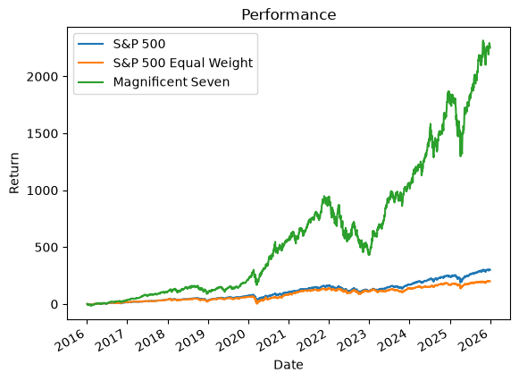

# Diversification in the S&P 500

Victor Miller · [GitHub](https://github.com/victor-mler) · [LinkedIn](https://www.linkedin.com/in/miller-victor)

An empirical study of concentration risk in the S&P 500 over 2016-2025.

The S&P 500 is the usual benchmark of passive diversification. Over the last ten years, a small group of large technology firms has grown so fast that it raises a question: does the index still spread risk, or has it become a bet on a few companies?

The short answer: the S&P 500 holds 500 names, but its effective number of constituents is about 48. It behaves like a portfolio of roughly 48 equally weighted stocks.

This notebook answers the question by comparing three portfolios:

- the cap-weighted S&P 500 (SPY)
- the S&P 500 Equal Weight (RSP), where each of the 500 constituents gets 0.2%
- an equal-weight basket of the Magnificent Seven (Microsoft, Apple, Nvidia, Amazon, Alphabet, Meta, Tesla)

The analysis covers volatility, correlation, normality, Sharpe and Sortino ratios, cumulative performance and maximum drawdown, and ends with the Herfindahl-Hirschman index and the effective number of constituents.

## Table of Contents

- [The question](#the-question)
- [Key results](#key-results)
- [What is inside](#what-is-inside)
- [Getting started](#getting-started)
- [Repository structure](#repository-structure)
- [Data and methodology notes](#data-and-methodology-notes)
- [License](#license)

## The question

A market-cap-weighted index grows with its biggest winners. When a handful of firms carry most of the weight, the index stops being a broad market proxy and starts being a concentrated bet, with all the tail risk that comes with it. This notebook measures how concentrated the S&P 500 has become, and what that means for the investors who use it as their default diversification tool.

## Key results

The main finding is about concentration. The S&P 500 holds 500 names, but its Herfindahl-Hirschman index of 208.92 corresponds to an effective number of constituents of about 48. The cap-weighted index behaves like a portfolio of roughly 48 equally weighted stocks, not 500.

| Metric | S&P 500 | Equal Weight | Magnificent Seven |
|---|---|---|---|
| Annualized volatility | 18.05% | 18.57% | 29.00% |
| Annualized Sharpe ratio | 0.74 | 0.57 | 1.16 |
| Compounded return over 10 years | +300.25% | +199.60% | +2251.74% |
| Maximum drawdown | -33.72% | -39.04% | -49.38% |

The Magnificent Seven earned far more than the two indices, but with the deepest drawdown. The S&P 500 has a higher Sharpe ratio than the equal-weighted version, which shows that less concentration and worse risk-adjusted performance are not the same claim.



## What is inside

The notebook is organized in nine sections, each built on reusable Python functions:

1. Data loading and preprocessing
2. Daily simple and log returns, portfolio synthesis
3. Historical and rolling volatility
4. Correlation matrix
5. Standardized moments, normality, Q-Q plot and Student t-fit
6. Sharpe and Sortino ratios (static and rolling)
7. Cumulative performance and maximum drawdown
8. Herfindahl-Hirschman index and effective number of constituents
9. Conclusion

## Getting started

To rerun everything from scratch:

1. Install the dependencies:

   ```
   pip install -r requirements.txt
   ```

2. Get a free FRED API key and put it in a `.env` file:

   ```
   FRED_API_KEY=your_key
   ```

   See `.env.example`. The key is used for the risk-free rate (3-month T-bill, series DGS3MO). Price data is downloaded with `yfinance`.

3. Open the notebook and run all cells.

The holdings file used in section 8 lives in `data/raw/` and is a State Street SPDR snapshot dated August 25, 2026.

## Repository structure

```
sp500-concentration-analysis/
├── sp500-concentration-analysis.ipynb   # the full analysis
├── README.md
├── requirements.txt
├── .env.example                         # FRED API key template
├── .gitignore
├── figures/
│   └── performance.png                  # key chart used in this README
└── data/
    └── raw/
        └── holdings-daily-us-en-spy.xlsx  # SPDR SPY holdings, 2026-08-25
```

## Data and methodology notes

All returns are price returns, dividends excluded. The three portfolios are measured on the same basis, so the comparisons stay fair.

The holdings weights are a *point-in-time snapshot*. Section 8 is about the current structure of the index, not its historical path.

The risk-free rate comes from FRED (DGS3MO) and is only used to build daily excess returns for the Sharpe and Sortino ratios.

## License

[MIT](LICENSE.txt)